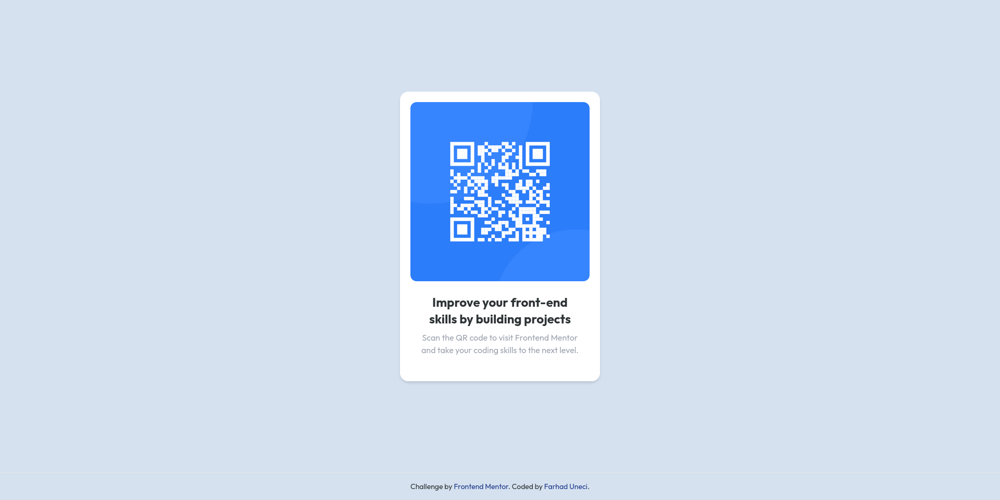

[Visit the demo](https://qr-code-component.iran.liara.run/)

Your challenge is to build out this QR code component and get it looking as close to the design as possible.

> A perfect first challenge if you're new to HTML and CSS.

The card layout doesn't shift, so it's ideal if you haven't learned
about building responsive layouts yet.

I have used TailwindCSS to style the page. You can use any CSS framework
or no framework at all.

## Demo

